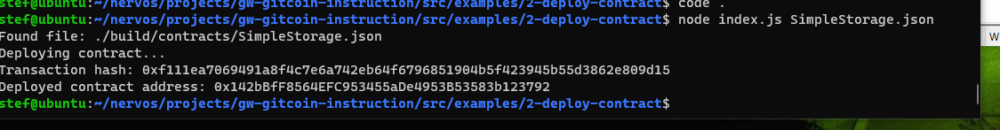

# Gitcoin: 2) Deploy A Simple Ethereum Smart Contract On Polyjuice

## 1. A screenshot of the console output immediately after you have successfully deployed a smart contract.

## 2. The transaction hash from the contract deployment (in text format).

0xf111ea7069491a8f4c7e6a742eb64f6796851904b5f423945b55d3862e809d15

## 3. The deployed contract address from the contract deployment (in text format).

0x142bBfF8564EFC953455aDe4953B53583b123792
