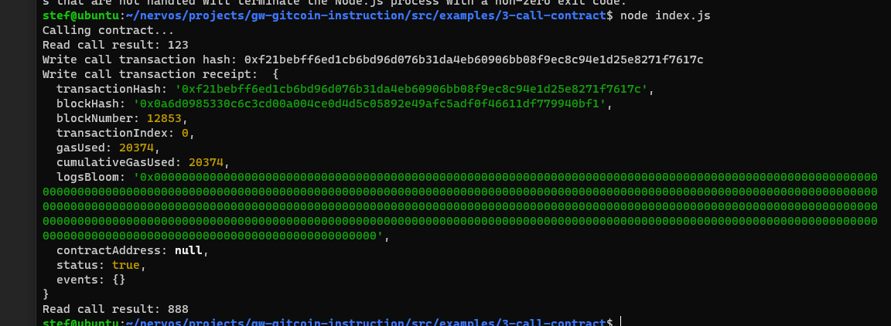

# Gitcoin: 3) Issue A Smart Contract Call To The Deployed Smart Contract

## 1. A screenshot of the console output immediately after you have successfully issued a smart contract call.


## 2. The transaction hash from the console output (in text format).

0xf21bebff6ed1cb6bd96d076b31da4eb60906bb08f9ec8c94e1d25e8271f7617c

## 3. The contract address that you called (in text format).

0x142bBfF8564EFC953455aDe4953B53583b123792

## The ABI for contract you made a call on (in text format).
```
>>>>>>> cb9c15dbd5745688b5814b9fe4e2d5414dbde4d7
 [
    {
      "inputs": [],
      "stateMutability": "payable",
      "type": "constructor"
    },
    {
      "inputs": [
        {
          "internalType": "uint256",
          "name": "x",
          "type": "uint256"
        }
      ],
      "name": "set",
      "outputs": [],
      "stateMutability": "payable",
      "type": "function"
    },
    {
      "inputs": [],
      "name": "get",
      "outputs": [
        {
          "internalType": "uint256",
          "name": "",
          "type": "uint256"
        }
      ],
      "stateMutability": "view",
      "type": "function"
    }
  ]
