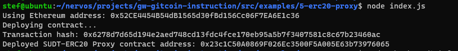
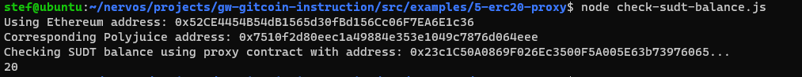

# Gitcoin: 5) Deploy The ERC20 Proxy Contract For The Deposited SUDT

## 1. A screenshot of the console output immediately after deploying smart contract.

## 2. The address of the ERC20 Proxy Contract you deployed (in text format).

0x23c1C50A0869F026Ec3500F5A005E63b73976065

## 3. A screenshot of the console output immediately after checking your SUDT balance.

## The Ethereum address that was checked (in text format).

0x52CE4454B54dB1565d30fBd156Cc06F7EA6E1c36

