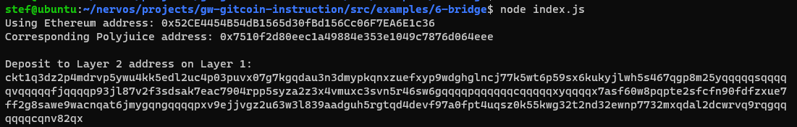

# Gitcoin: 6) Use Force Bridge To Deposit Tokens From Ethereum To Polyjuice

## 1. A screenshot of the console output immediately after you have successfully generated your Deposit Receiver Address.

## 2. Your Deposit Receiver Address (in text format).

ckt1q3dz2p4mdrvp5ywu4kk5edl2uc4p03puvx07g7kgqdau3n3dmypkqnxzuefxyp9wdghglncj77k5wt6p59sx6kukyjlwh5s467qgp8m25yqqqqqsqqqqqvqqqqqfjqqqqp93jl87v2f3sdsak7eac7904rpp5syza2z3x4vmuxc3svn5r46sw6gqqqqpqqqqqqcqqqqqxyqqqqx7asf60w8pqpte2sfcfn90fdfzxue7ff2g8sawe9wacnqat6jmygqngqqqqpxv9ejjvgz2u63w3l839aadguh5rgtqd4devf97a0fpt4uqsz0k55kwg32t2nd32ewnp7732mxqdal2dcwrvq9rqgqqqqqqcqnv82qx

## 3. The Ethereum address used to generate the Deposit Receiver Address (in text format).

0x52CE4454B54dB1565d30fBd156Cc06F7EA6E1c36

## 4. A link to the Etherscan explorer for the successful Force Bridge transaction. This can be found on Force Bridge under History→Succeed.

https://rinkeby.etherscan.io/tx/0x071c8f024abfd3a3911a22bf8247763e2b500cc854e8a83202d09eada2804d61

## 5. A link to the Etherscan explorer for the successful Force Bridge transaction. This can be found on Force Bridge under History→Succeed.

https://explorer.nervos.org/aggron/transaction/0x256187d601faca00d85a94eaaa7c4e8f99e42daa07f198856a0bf2d6aae42258

